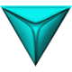

# Brand and Logo

### **Initium**&#x20;

Initium means the beginning in the Latin language. It represents the concepts behind the protocol as a new beginning for innovations in the blockchain industry.&#x20;

### **Initium Logo**

The Initium logo represents the three pillars of the Initium blockchain, including security, scalability, and decentralization in form of a triangle. It represents the logo for [INIX](../initium-ecosystem/crypto-economics/initium-tokenomics/what-is-inix/), the native token of Initium blockchian.&#x20;

### **Initium Foundation Logo**

The Initium Foundation logo represents the Initium logo and INITIUM logotype.&#x20;

.png>)

### Initium Labs Logo

Initium Labs logo is represents the concept of genesis. The circle behind the Initium logo represents the the Inanis (means the void in the Latin language).&#x20;

Lynx Logo&#x20;

The Lynx logo is inspired by the lynx (the wild cat). It is available for both dark and white backgrounds.&#x20;

