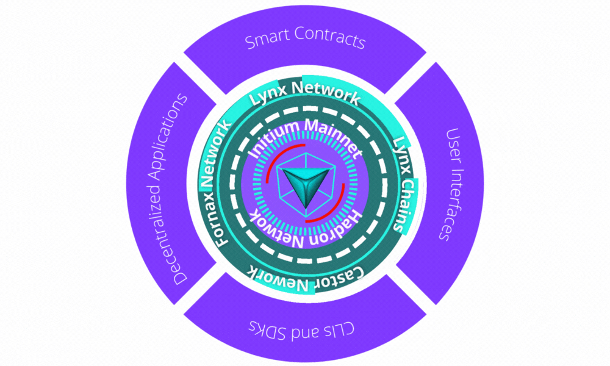

# Initium Networks

Initium blockchain contains different networks. Each network is designed for different purposes to extend the employment of Initium technology. The proposed networks for Initium Genesis are:

* [Hadron](initium-networks.md#hadron-network)&#x20;
* [Castor](initium-networks.md#hadron-network-1)
* [Fornax](initium-networks.md#fornax)&#x20;
* [Lynx](initium-networks.md#lynx-network)
* [Orion](initium-networks.md#orion)

All validators in the Initium blockchain should support all networks to be eligible for joining a validator squad.&#x20;

### Hadron Network

Hadron network is the mainnet of Initium for launching applications, smart contracts, tokens, and transactions on the Initium blockchain. Participants, including validators and stakers, will obtain rewards and fees from the transactions on the Hadron network. &#x20;

Hadron network will be available by Genesis Event at https://hadron.initium.network

### Castor Network

Castor network is the L2 network of Initium for launching applications, smart contracts, and tokens compatible with Ethereum Virtual Machine (EVM) on the Initium blockchain. This network relies on the Hadron network for confirmation of transactions. Using the Castor network, the projects running on  Ethereum-like blockchains (e.g. Polygone, BSC, etc.) can easily integrate with Initium and benefit from its liquidity, scalability, and security.&#x20;

Castor network will be available by Genesis Event at https://castor.initium.network.

### Fornax Network

Fornax network is the Devnet of Initium. It's a playground for those looking to experience the protocol as a blockchain user, token holder, app developer, or network validator. Fornax network will have the INIX Faucet, which the users can obtain virtual INIX for testing their applications and smart contracts before launching on the Hadron network.

Fornax network will be available by Genesis Event at https://fornax.initium.network.

### Lynx Network

Lynx is essentially a protocol for launching Lynx networks––the consortium networks and private blockchains–– based on the Initium technology. Lynx network is where the users can launch their blockchains using the Lynx protocol. In every Lynx network, a pre-defined set of trusted nodes controls the consensus process. These nodes are the existing Certified Initium Validators that the participants of a given private blockchain chose to validate their transactions by paying rent fees in INIX to the validators. Every validator can offer its rental rate in the Lynx marketplace. Although every network on Lynx can have its native token for defined functions on the blockchain (e.g., voting, governance, etc.), the transactions of these networks are conducted on the Hadron network, and leptons pay the transaction fees. A validator may contribute to several consortium networks. The validators must activate their config's Lynx portal to enable the Lynx network.

\
Lynx network will be available by the Genesis Event at https://lynx.initium.network.&#x20;

Lynx Protocol will be available for teams, organizations, institutions, and enterprises at https://lynxpro.net.

### Orion

Orion is the testnet of Initium and will be available before the other networks. The purpose of Orion is to serve as an environment where recent releases undergo a stress test that focuses on network performance, stability, and the behavior of network validators. Users can use Orion to learn the Initium blockchain before adopting it. All validators support the Orion in the Initium ecosystem. It will be available at https://orion.initium.network.&#x20;
