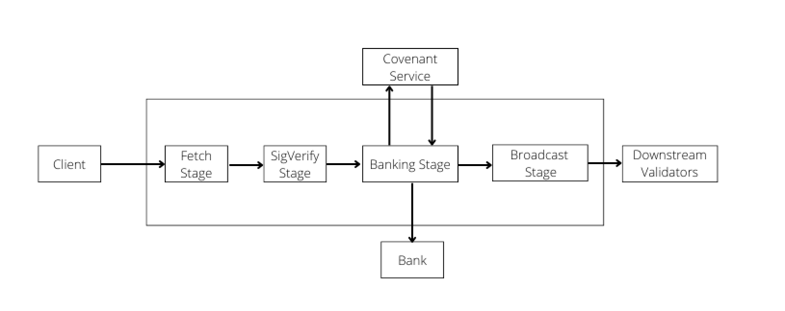
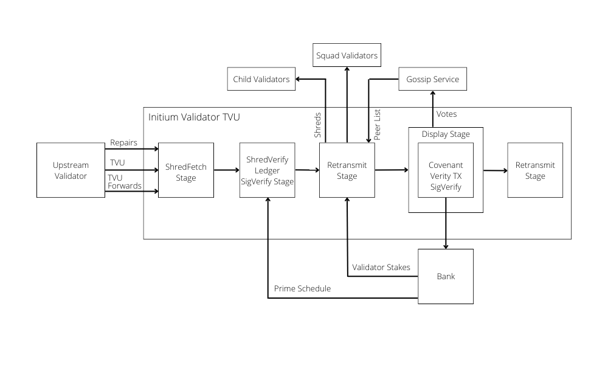

# TPU & TVU

### TPU

TPU (Transaction Processing Unit) is the logic of the validator responsible for block production.

Transactions encoded and sent in UDP packets flow into the validator from clients (other validators/users of the network) as follows:

* Fetch stage: allocates packet memory and reads the packet data from the network socket and applies some coalescing of packets received at the same time.
* Sigverify stage: deduplicates packets and applies some load-shedding to remove excessive packets before then filtering packets with invalid signatures by setting the packet's discard flag.
* Banking stage: decides whether to forward, hold or process packets received. Once it detects the node is the block producer it processes held packets and newly received packets with a Bank at the tip slot.
* Broadcast stage: receives the valid transactions formed into entries from the banking stage and packages them into shreds to send to network peers through the turbine tree structure. Serializes, signs, and generates erasure codes before sending the packets to the appropriate network peer.

### TVU

TVU (Transaction Verification Unit) is the logic of the validator verifying the block.&#x20;

\
