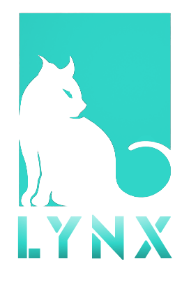

# Lynx

Lynx is an open-source framework for building multi-asset PoSync (Covenant) public blockchains and permission Proof-of-Authority (PoA) blockchains using the Lynx network of Initium. Blockchains built with the Lynx are generally referred to as **Lynx Blockchains.**&#x20;

****

Every Lynx Blockchain can connect to other blockchains on the Lynx network, which increases their interoperability. Lynx SDK will facilitate the launching of a new blockchain in easy steps. Initium Labs will announce further information about the Lynx project.&#x20;
